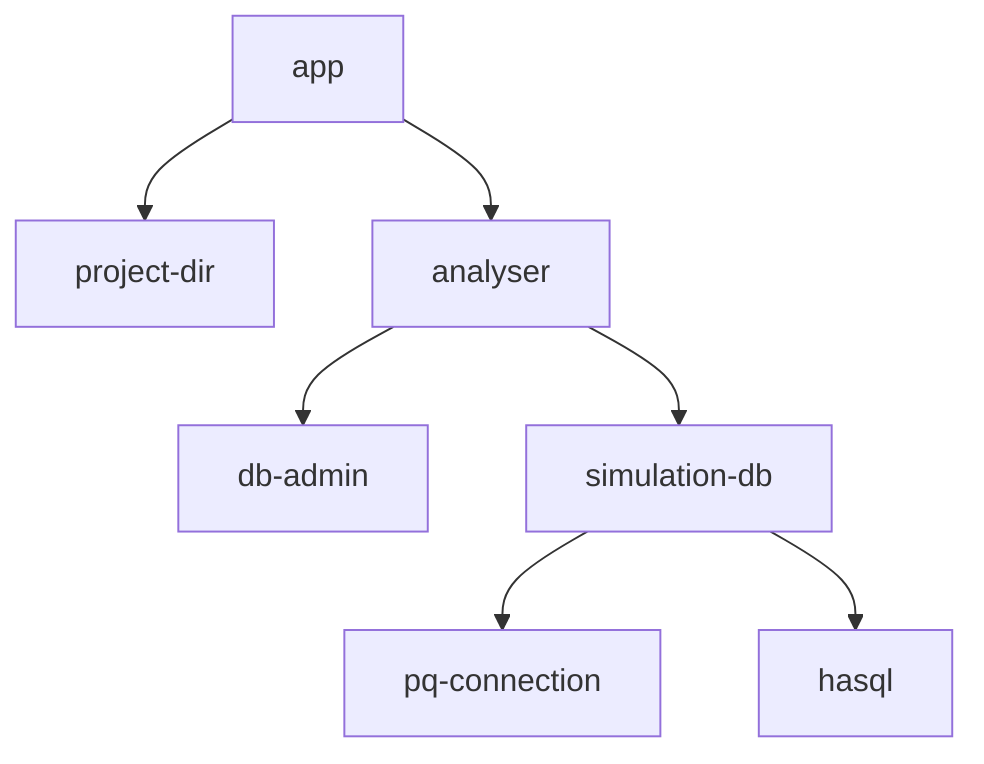

# Module Structure Options

## Tree

- Context
- Procedures: the operations that the CLI app performs.
  - Generate
    - Mapping to CLI commands
  - Load project config
  - Load migrations
  - Load queries with metadata
  - Analyse: `ProjectConfig -> Migrations -> Queries -> [AnalysedQuery]`
  - Generate code
- Domain
  - ProjectConfig
  - AnalysedQuery
- Services: services available to all procedures and possibly reachable from context
  - Analyser
    - Context
    - Services
      - DbAdmin
        - Context
        - Procedures
          - CreateDb
          - DropDb
      - SimulationDb: Temporary simulation database
        - Context
          - ? depends-on:
            - ../../DbAdmin as the outer context for resource-management
          - encapsulates:
            - HasqlPool
        - Services
          - PqConnection
            - Context
            - Procedures
              - DescribeQuery
          - Hasql
            - Procedures
              - RunStatement
        - Procedures
          - RunMigrations
          - ModelQuery
          - ResolveColumn
          - ResolveParamNullabilities
          - ResolveTypeByOid
    - Domain: Codec structure
    - Procedures
      - Analyse (migrations and queries)

## Services Abstraction Hierarchy

