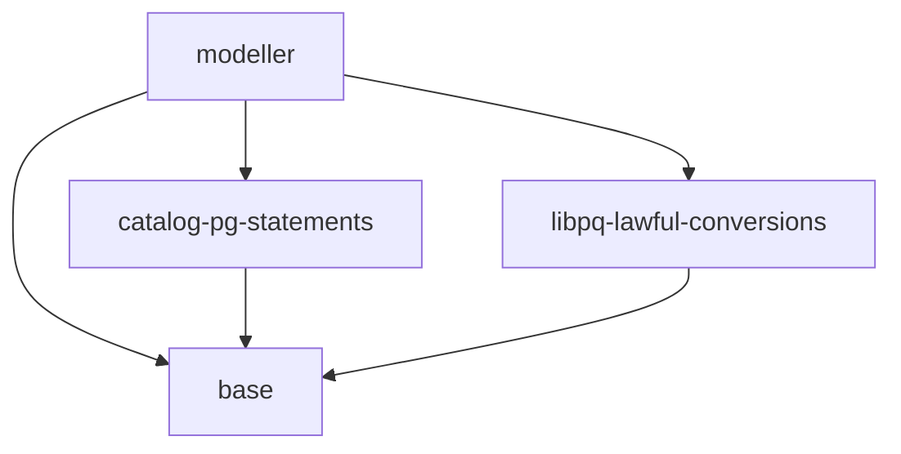

# Dependency structure of sublibs

```mermaid
graph TD

modeller --> catalog-pg-statements
modeller --> libpq-lawful-conversions

modeller --> base
catalog-pg-statements --> base
libpq-lawful-conversions --> base
```
