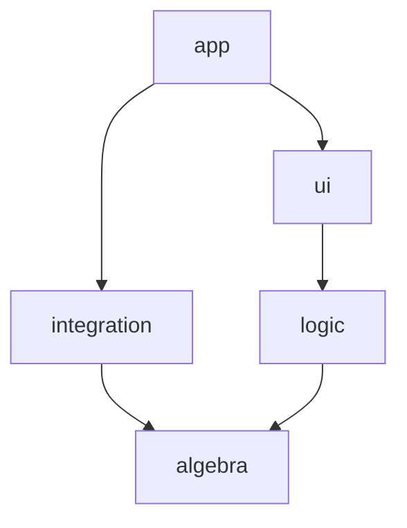
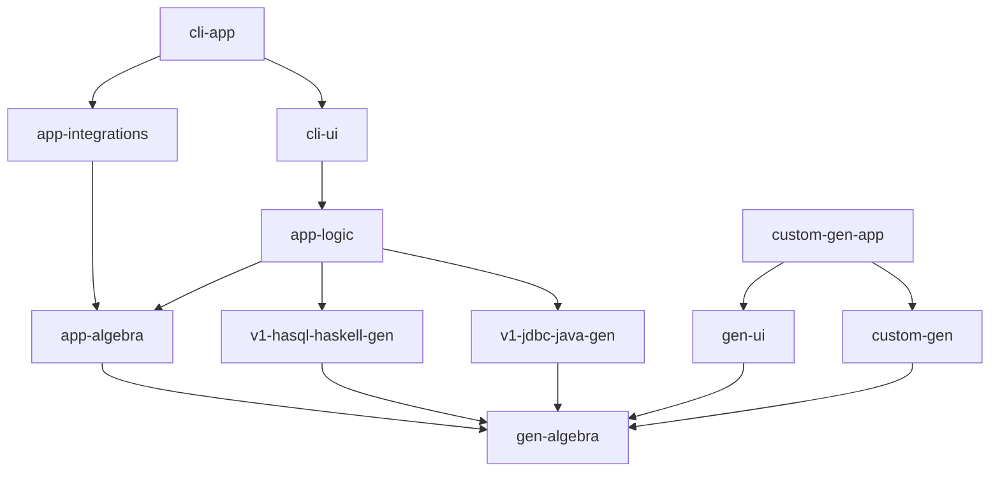

# Abstract

- App: initializes integrations and supplies them to UI
- Integration: implementation of abstractions in algebra
- UI:
  - rest-api running unintegrated logic
  - CLI arguments parser triggerring unintegrated logic
- Logic:
  - Features implemented based on algebra
  - Business logic
- Layers may be skipped if they are not needed
- A component exposes any of these layers

# Specific

