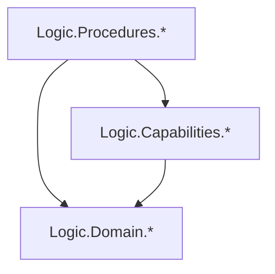

# ADR 0001: Split Logic Layer into Procedures, Capabilities, and Domain

**Status:** Accepted

**Date:** 2026-07-07

## Context

The `logic` component of pgenie mixed workflow orchestration, service interfaces (type-class ports), and pure domain types under a single `Logic.Features` namespace. The layout made it hard to tell which modules described the domain, which declared required services, and which stitched operations together. As the project grows, this ambiguity risks circular imports and makes it harder to add new workflows or replace interpreters.

The project glossary in `CONTEXT.md` already distinguishes orchestration workflows (`Analyse`, `Generate`, `ManageIndexes`) from the domain terms they operate on (`Project File`, `SQL Template`, `Signature File`, `Artifact`, etc.). The module structure should reflect that distinction.

## Decision

Split every module in the logic layer into one of three namespaces with strict dependency directions:

- `Logic.Procedures.*` — workflow/orchestration modules (e.g., `Analyse`, `Generate`, `ManageIndexes`). These contain `Params`, `Result`, and procedure-specific helpers.
- `Logic.Capabilities.*` — capability classes (type-class ports) named as predicates under the `haskell-design-system` naming convention. Examples: `Stages`, `Warns`, `ExecutesMigrations`, `InfersQueryTypes`, `ExplainsQuery`, `LoadsIndexes`, `ManagesFiles`, `LoadsGenerator`.
- `Logic.Domain.*` — pure domain types and functions. Domain modules are flat and renamed to match the domain terms in `CONTEXT.md`:
  - `ProjectModel` → `ProjectFile`
  - `SqlTemplates` → `SqlTemplate`
  - `QuerySignatures` → `QuerySignature`
  - `CustomTypeSignatures` → `CustomTypeSignature`

The `Logic.Features` namespace is removed. `Logic.hs` remains the test aggregator, now delegating to `Logic.Domain.spec`, and a new `Logic.Capabilities` aggregator re-exports all capability classes. No `Logic.Procedures` aggregator is introduced.

### Dependency rule

Dependencies must point in the following directions only:

```text
Procedures -> Capabilities
Procedures -> Domain
Capabilities -> Domain
```

In Mermaid:



That is:

- Domain may not import Capabilities or Procedures.
- Capabilities may import Domain, but not Procedures.
- Procedures may import both Capabilities and Domain.

### Supporting rules

- Each capability module contains only its class. Domain types and functions that lived beside capability classes move to `Logic.Domain`.
- Procedure modules keep `Params`, `Result`, and helpers specific to the workflow. Generic domain types move to `Logic.Domain`.
- Type aliases such as `type Services m = ...` are allowed inside procedure modules for ergonomics, but every capability must remain a first-class type class, not hidden behind an alias.
- `Report` moves to `Logic.Domain.Report`.
- `MonadError Report` remains a superclass constraint on capabilities that can fail.
- Interpreter/infra adapter modules are only updated to match the new import paths; the adapters themselves are not renamed as part of this change.

## Consequences

- The code structure now matches the language in `CONTEXT.md`: workflows, capabilities, and domain concepts each have a dedicated place.
- Dependency cycles between workflows and service interfaces become structurally impossible if the rule is followed.
- Replacing or adding an interpreter only touches `Logic.Capabilities` imports and the adapter modules, not procedure code.
- The flat `Logic.Domain` layout and singular domain module names make it easier to find the canonical type for each concept.
- Procedure modules may accumulate small aliases and helpers; those should be reviewed during future architecture sessions to avoid re-introducing domain logic into workflows.
